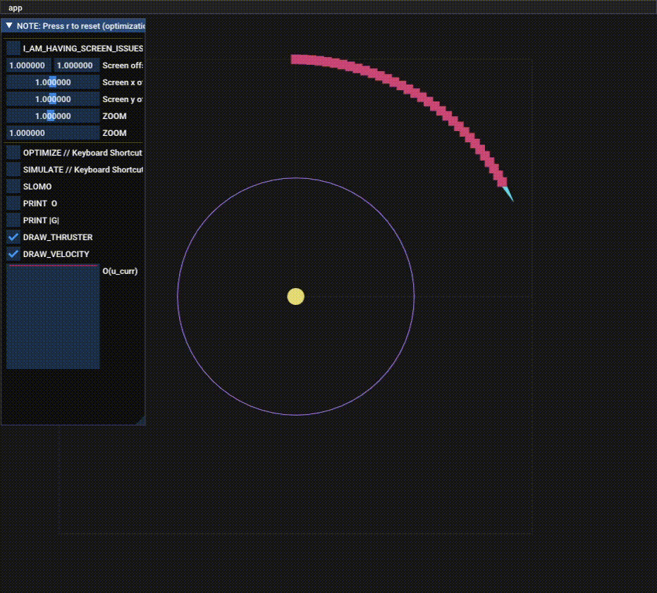
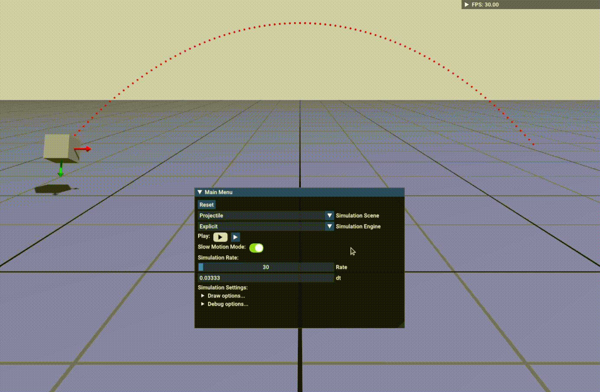

  

    
This page showcases some of my work in modelling dynamic motion with C++ during the course Computational Models of Motion at ETH Zurich.

    

      <h3>Walking legged controller</h3>
      
Kinematic walking controller for the unitree legged robot. Consists of inverse kinematics for all four legs and joints, analytical and finite difference jacobian definitions, as well as velocity trajectory planning.

        

        
        

        <a href="https://github.com/maturk/Kinematic_Walking_Legged_Controller">GitHub page</a>
     
    <h3>FEM</h3>
    
I implemented a finite-element-method (FEM) solver for a soft rigid body. The rigid body is controlled by pins at both ends and a minimum energy and force optimizer is implemented to achieve equilibrium state. A total energy objective is defined and minimized using Newtons method (second order Hessian method) for equilibrium conditions.

      

        
      

        <a href="https://github.com/maturk/FEM_Soft_Body_Simulation">GitHub page</a>
    

     
    <h3>Trajectory Optimization</h3>
    
I implemented two methods for trajectory optimization: direct shooting and transcription methods for simple projectile motion tasks. The demos show how the optimization works. Gradient descent line search optimization is used to find solutions to the direct shooting and transcription methods.

        

          
        

        <a href="https://github.com/maturk/Trajectory_Optimization">GitHub page</a>
     
    <h3>Rigid Body Dynamics</h3>
    
 I implemented rigid body dynamics simulator for projectile motion, spring like system, and a bouncing ball with contact constraints.

        

          
        

        <a href="https://github.com/maturk/Rigid_Body_Dynamics">GitHub page</a>
  

