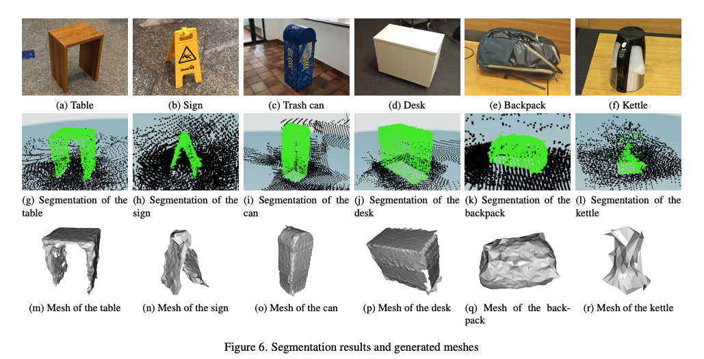

  

  

        <svg class="svg-icon grey"><use xlink:href="{{ '/assets/minima-social-icons.svg#pdf' | relative_url }}"></use></svg>
        Report: <a href="{{ site.baseurl }}/assets/reports/{{ page.report }}" target="_blank">{{ page.report }}</a>
    
 
        
 This page showcases our team project for 3D volumetric segmentation from egocentric views using the Microsoft HoloLens 2. We implemented Theodora Kontogianni et al.'s paper
        <a href="https://arxiv.org/abs/2204.07183">Interactive Object Segmentation in 3D Point Clouds</a> on the HoloLens 2.
        
 
    <h3>Background</h3>
    
3D semantic segmentation is important for various applications in general scene understanding tasks. However, annotating ground truth datasets is a time-consuming and costly process. We propose an auto-labeling tool using the Microsoft HoloLens 2 for interactive egocentric object segmentation. We implement a tool on the HoloLens capable of visualizing point clouds, segmentation results, iterative refinement of segmentations, as well as a 3D mesh visualizer of the final segmentation. 
      
    The backbone of the segmentation model is a neural network architecture based on the Nvidia<a href="https://github.com/NVIDIA/MinkowskiEngine"> Minkowski Engine</a> trained for volumetric segmentation on point clouds on the <a hfref="http://www.scan-net.org">Scannet</a> dataset. User labels, which are gathered by pointing a finger towards objects in the scene, as well as the full point cloud of the scene are the inputs to the network. A binary classification head outputs a segmentation mask for the desired object. 
      
    This interactive first-person semantic segmentation tool significantly improves the time and effort required for labeling tasks in custom environments and enables faster workflows for other research endeavors. Furthermore, it allows for real-time verification and correction of segmentations with minimal user annotation.

    <h3>Results</h3>
    

        
      

    <h3>Demo Video</h3>
    <video height="400" loop="true" autoplay="autoplay" controls="controls" id="vid" muted>
            <source src="../assets/images/mixed_reality_demo.mp4" type="video/mp4">
            Your browser does not support the video tag.
    </video>
      
    <h3>Tools Used</h3>
    <ul>
        <li>C#, Python, and Unity.</li>
        <li>Libraries used: </li>
        <ul>
          <li>PyTorch for the segmentation model</li>
          <li>Python Socket Library for TCP client-server connection between an off-board linux computer and Hololens</li>
        </ul>
    </ul>        
  

