

  

  

    

        <svg class="svg-icon grey"><use xlink:href="{{ '/assets/minima-social-icons.svg#pdf' | relative_url }}"></use></svg>
        Code: <a href="{{ site.baseurl }}/assets/reports/{{ page.github }}" target="_blank">{{ page.github }}</a>
    
 
    

    

    

        <svg class="svg-icon grey"><use xlink:href="{{ '/assets/minima-social-icons.svg#pdf' | relative_url }}"></use></svg>
        Report: <a href="{{ site.baseurl }}/assets/reports/{{ page.report }}" target="_blank">{{ page.report }}</a>
    
 
    

    

    Work in progress...    
    This page showcases my work on 3D Object Reconstruction from images. The main goal is to learn category level object class and shape information from a large dataset of shape models. I trained a 
    auto-encoder neural network architecture on multi-view images of common objects from the ShapeNet dataset.  

    

    <h2>Multi-View Image Dataset</h2>
    
 I used Blender scripts to automatically generate synthetic renders of models from the ShapeNet dataset. I render ground truth color and depth images as well as ground truth camera poses, point cloud, and voxel grid information. Below you can see some example renders. 
    

    

        
    
  
    <h2>Architecture</h2>
    
 The multi-view auto-encoder consists of a <a href="https://arxiv.org/abs/1612.00593">PointNet</a> like encoder network that fuses embedding vectors from multiple views. The intuition is that regardless of the viewing angle or pose of the input image, each image of the same object should project to the same latent representation. The decoder network is composed of series of linear and 2D convolutional layers that expand the shape embedding vector to a voxel grid of size 128x128x128. I use the cross-entropy loss for shape reconstruction loss and I use a contrastive loss on the embedding vectors to promote clustering in the latent space. 

    

        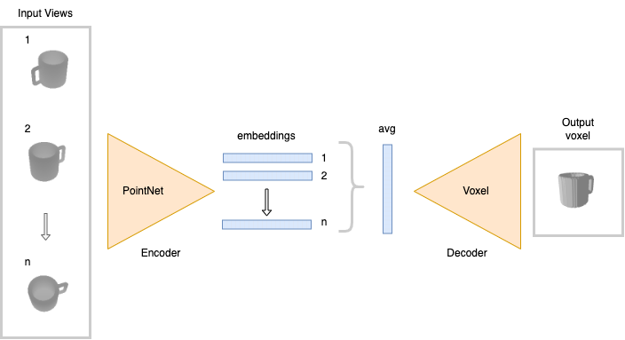
    
  
    <h2>Results</h2>
    
I trained my network for 4 days with 6 RTX 2080 GPU's on the <a href = "https://scicomp.ethz.ch/wiki/Euler">Euler</a> compute cluster. The dataset consisted of 8 object categories with 50 object instances each and 16 input color/depth views.
    

    <h3>Quantitative</h3>
    
 I evaluate reconstruction performance with a cross-entropy loss, chamfer distance loss, and intersection over union. I run ablation studies and find that increasing the number of input views to the network improves reconstruction.

    

      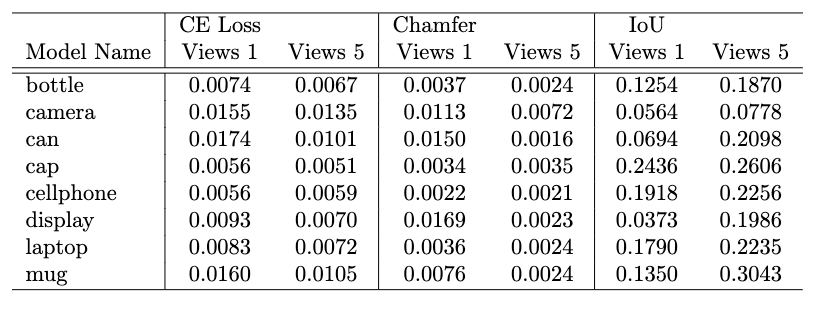
    

   

        

        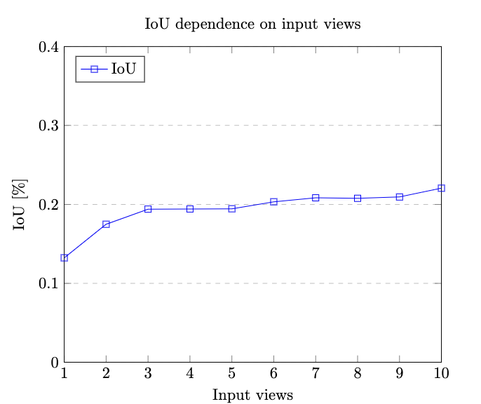
        

        
 
            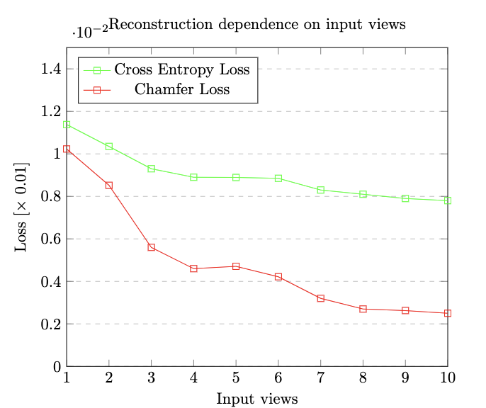
        

    

    <h3>Qualitative</h3>
    

        

        

        
Ground Truth

            
            
            
            
            
            
        
 
        

        
1 Input View Prediction

            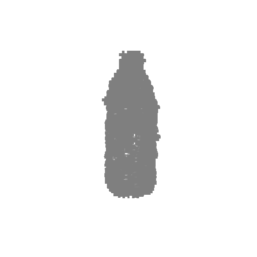
            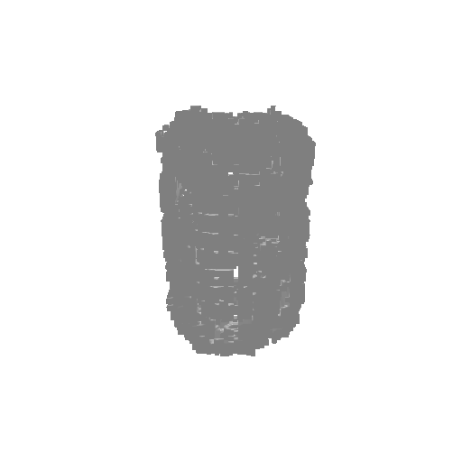
            
            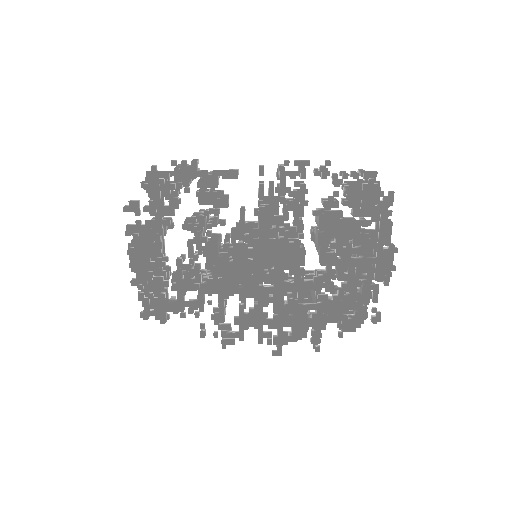
            
            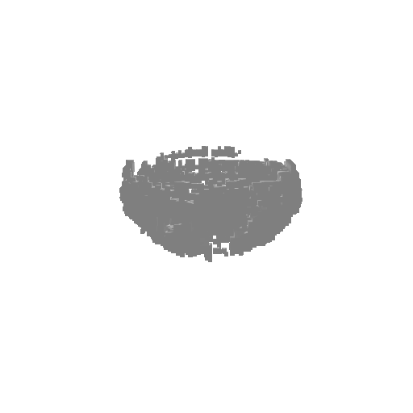
        

        

        

        
 
        
5 Input View Prediction

            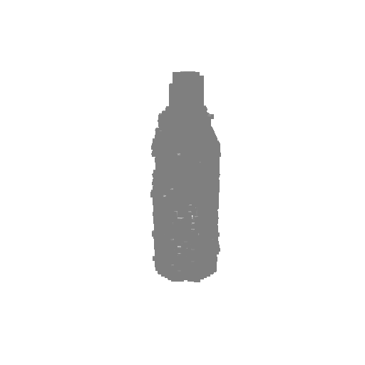
            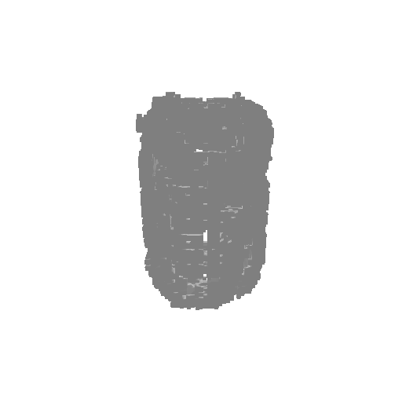
            
            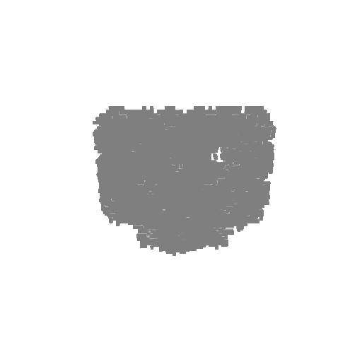
            
            
        

        

        
1-5 Input View Prediction
 
            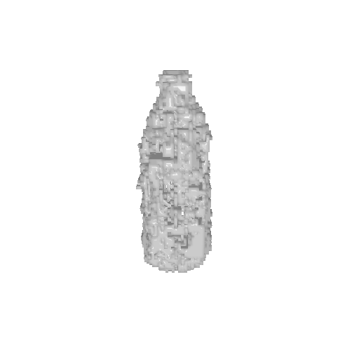
            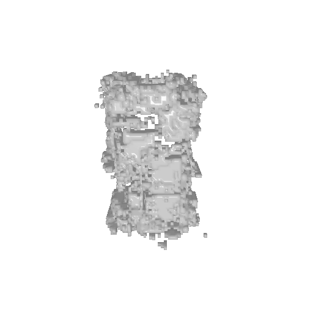
            
            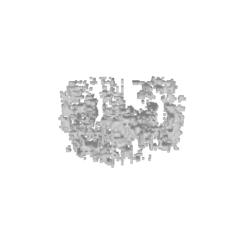
            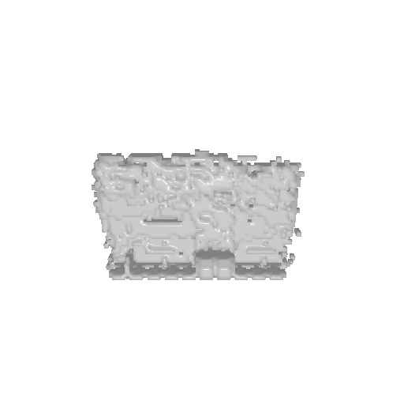
            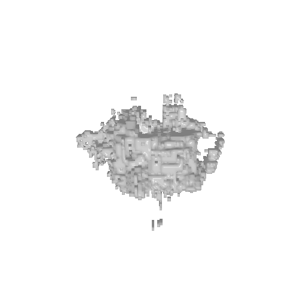
        

    

    
The auto-encoder embedding space is clustered into classes as seen in the following TSNE embedding illustration:

     

        
    
  
    <h3>Tools Used</h3>
    <ul>
        <li>Python, Blender, and various bash scripts.</li>
        <li>Main libraries: PyTorch, <a href="https://github.com/facebookresearch/pytorch3d">PyTorch3D</a>, OpenCV, and Open3D.</li>
    </ul>