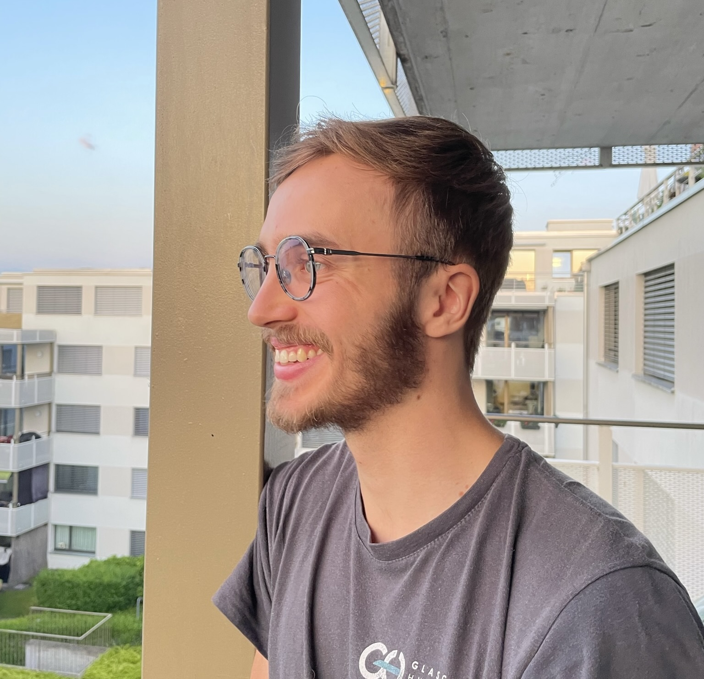

## About Me
<tr>
    <td></td>
    <td>

		Ph.D. Student @ Aalto University  
        MSc @ ETH Zurich  
		  
		<a href="mailto:matiasturkulainen@gmail.com">
			<i class="fa fa-envelope" aria-hidden="true"></i> matiasturkulainen@gmail.com</a>   
		<a href="https://github.com/maturk">
			<i class="fa fa-github" aria-hidden="true"></i> Github </a>   
		<a href="https://scholar.google.com/citations?user=9ixpc8MAAAAJ&hl=en&oi=ao">
			<i class="fa fa-google" aria-hidden="true"></i> Google Scholar </a>   
		<a href="https://www.linkedin.com/in/matias-turkulainen/">
			<i class="fa fa-linkedin" aria-hidden="true"></i> LinkedIn </a>
             
	
</td>
</tr>

I am from Finland 🇫🇮. I am interested in learning new things, and lately, my focus has been on computer vision, computer graphics, and programming. Besides that, I enjoy riding my bike and drinking coffee. I am starting a PhD with [Juho Kannala](https://users.aalto.fi/~kannalj1/) and [Arno Solin](https://users.aalto.fi/~asolin/).

## Publications



### {{ year.name }}	
---


<table class="paper-list">
  <tr>
  	
    <td></td>
	
	
    <td>
		

		<video width="80%" height="80%" muted autoplay loop>
			<source src="{{paper.paper-logo-mp4}}" type="video/mp4">
			Your browser does not support the video tag.
		</video>
		

	</td>
	
    <td>
		
{{paper.paper-title}}
  
		

			
				
					{{author.name}}.
				
					{{author.name}},
				
			
		

		
{{paper.paper-pub}}

		

			
			<a href="{{paper.link-pdf}}" target="_blank" rel="noopener">
				<i class="fa fa-file-pdf-o" aria-hidden="true"></i> PDF </a>
			

			
			<a href="{{paper.link-arxiv}}" target="_blank" rel="noopener">
				<i class="fa fa-file" aria-hidden="true"></i> arXiv </a> 
			

			
			<a href="{{paper.link-projectpage}}" target="_blank" rel="noopener">
				<i class="fa fa-link" aria-hidden="true"></i> ProjectPage </a>  
			

			
			<a href="{{paper.link-supplementary}}" target="_blank" rel="noopener">
				<i class="fa fa-file-pdf-o" aria-hidden="true"></i> Supplementary </a>  
			

			
			<a href="{{paper.link-gitcode}}" target="_blank" rel="noopener">
				<i class="fa fa-github" aria-hidden="true"></i> Github </a>  
	        

			
			<a href="{{paper.link-gitcode}}" target="_blank" rel="noopener">
				<i class="fa " aria-hidden="true"></i></a>  
				<iframe style="margin-left: 2px; margin-bottom:-5px;" 
					frameborder="0" scrolling="0" width="100px" height="20px"
	                src="{{paper.link-gitcode-button}}">
	        	</iframe>
	        

	        
			<a href="{{paper.link-gitdata}}" target="_blank" rel="noopener">
				<i class="fa fa-github" aria-hidden="true"></i> Dataset </a> 
	        

	        
	        <a href="{{paper.link-video}}" target="_blank" rel="noopener">
				<i class="fa fa-file-video-o" aria-hidden="true"></i> Video </a> 
			

			
	        <a href="{{paper.link-video1}}" target="_blank" rel="noopener">
				<i class="fa fa-file-video-o" aria-hidden="true"></i> Video1 </a> 
			

			
	        <a href="{{paper.link-video2}}" target="_blank" rel="noopener">
				<i class="fa fa-file-video-o" aria-hidden="true"></i> Video2 </a> 
			

			
	        <a href="{{paper.link-slides}}" target="_blank" rel="noopener">
				<i class="fa fa-files-o" aria-hidden="true"></i> Slides </a> 
			

			
	        <a href="{{paper.link-poster}}" target="_blank" rel="noopener">
				<i class="fa fa-file" aria-hidden="true"></i> Poster </a> 
			

		

	</td>
  </tr>
</table>



---
## Open-source projects
<tr>
    <td>

        <a href="https://github.com/nerfstudio-project/gsplat">
			<i class="fa fa-github" aria-hidden="true"></i> gsplat:</a> a modular reimplementation of the 3D Gaussian Splatting backend.
              
              
        <a href="https://github.com/nerfstudio-project/nerfstudio">
			<i class="fa fa-github" aria-hidden="true"></i>  Nerfstudio:</a> I am a maintainer on the collaborative Nerfstudio project, trying to bring this technology to more users. I am pretty active on Discord too (@maturk).
              
	
</td>
</tr>

---
## Invited talks

Date | Event | Details
-----|-------|--------
April, 24th 2024 | FMX 2024  | Survey on NeRFs and 3DGS for the Lighting & Rendering track organized by [Christophe Hery](https://www.linkedin.com/in/christophehery/) in Stuttgart, Germany. Thank you all for the great time there!
May, 6th 2024 | Machine Learning Coffee Seminar | Finnish Center for Artificial Intelligence (FCAI) [talk](https://fcai.fi/calendar/2024/5/6/juho-kannala-tba) on neural rendering.
July, 6th 2024 | Gaussian splatting online meetup | Talk about Nerfstudio project for splatting enthusiasts. YouTube [link](https://www.youtube.com/watch?v=kfXrnkXiN8E).

---
 
> No man is an island, entire of itself; every man is a piece of the continent, a part of the main. And therefore never send to know for whom the bell tolls; it tolls for thee. - J. Donne